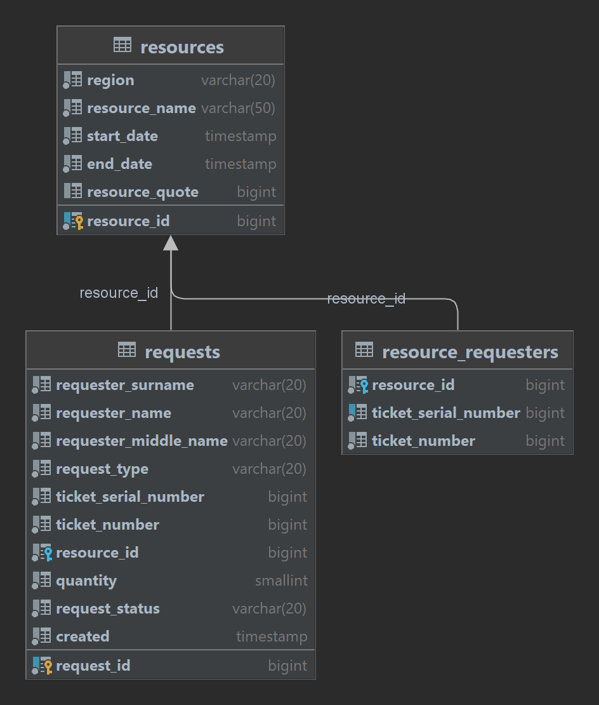

# test_task_foxcom
Repository for a test task for Foxcom

Мультимодульное Web Приложение hunting-request-distribution-app позволяет сохранять и загружать охотничьи ресурсы и заявки на получение этих ресурсов, а также автоматически проверять заявки и одобрять или отклонять их.
Возможно добавление, редактирование, удаление ресурсов и заявок, получение данных постранично. Также реализован запуск автоматической проверки добавленных заявок с возможностью остановить проверку.

Програмные модели, реализованные в данном приложении:

resource(охотничий ресурс) - содержит уникальный номер (ID), регион ресурса, название ресурса, дату начала подачи заявок, дату окончания подачи заявок, максимальную квоту ресурса.

request(заявка на ресурс) - содержит уникальный номер (ID), фамилию, имя, отчество, тип заявки, серию и номер охотничьего билета, запрашиваемый ресурс, количество ресурся, статус заявки, дату создания.

Приложение состоит из двух осноных модулей:
hunt_main_service - отвечает за сохранение и выгрузку данных, а также сожержит подмодуль DTO, содержащий модели и классы для работы с моделями.
hunt_check_service - выполняет автоматическую проверку всех поступивших заявок.
Взаиможействие между модулями осуществляется с помощью WeBClient.

После скачивания и распаковки архива запуск приложения возможен с помощью скрипта start.sh, остановка с помощью stop.sh Приложение загружает с GitHub последнюю версию приложения, собирает и запускает Docker image.
Приложение развертывается в трех Docker контейнерах, один для базы данных и по одному для каждого из модулей приложения.

Для тестирования в приложение есть Postman коллекция, содержащая базовые тесты на все реализованные эндпойнты.
В файле data.sql находятся сгенерированные с помощью mockaroo.com скрипты, для предзаполнения таблиц данными

Для запуска автоматической проверки всех поступивших заявок отправить GET запрос на эндпойнт http://localhost:9090/check/start после окончания проверки возвращается обработанных заявок
Для остановки, не дожидаясь окончания проверки всех имеющихся заявок отправить GET запрос на эндпойнт http://localhost:9090/check/stop возвращается список заявок обработанных до остановки. Далее можно возобновить проверку снова отправив запрос на start эдпойнт

При необходимости приложение можно расширить, добавив новую функциональность.

В приложении подключены зависимости: spring-boot-starter-web, spring-boot-starter-data-jpa, spring-boot-starter-validation, postgresql, lombok, spring-boot-starter-actuator,
spring-boot-starter-webflux

Стек технологий: Java11, Spring Boot 2.7, Maven, PostgreSQL, Lombok, Spring JPA, REST, Docker, Hibernate, WebClient

## Схема БД

